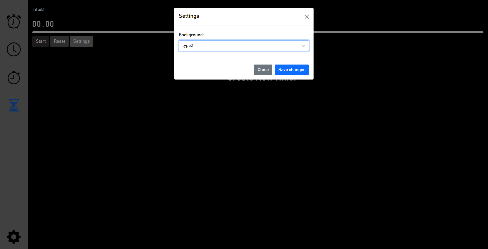
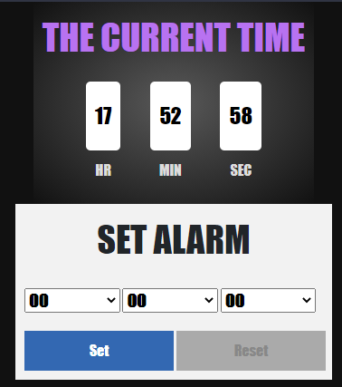
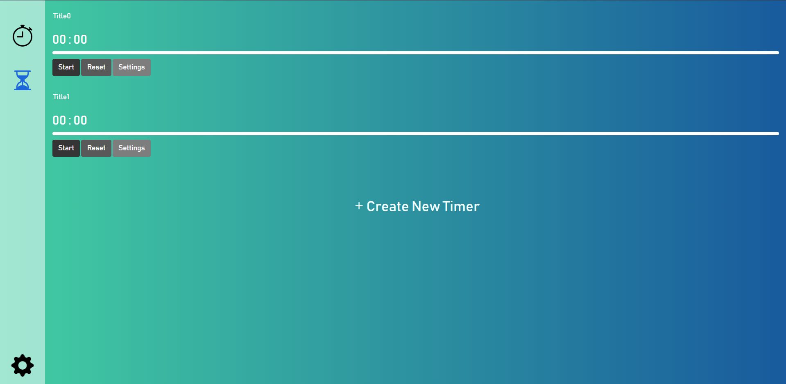
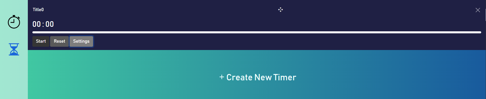
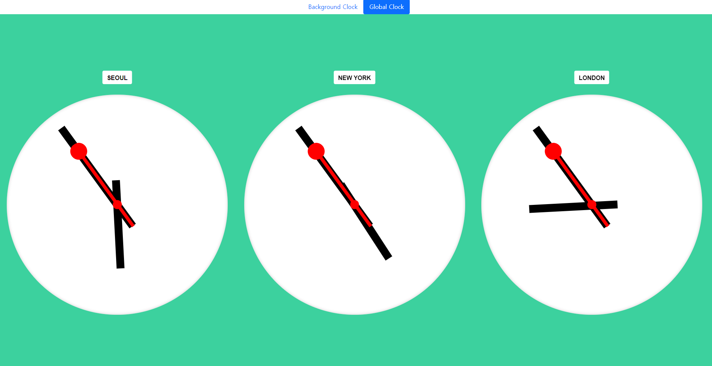
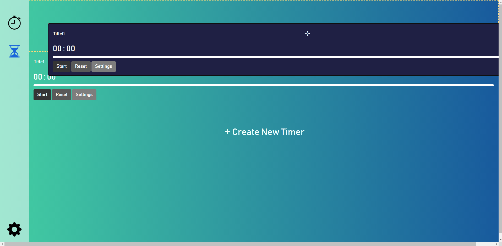
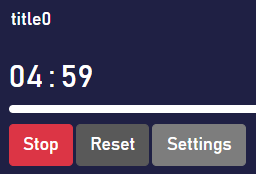

# theClock

the Clock Website

-A brief overview\
-Links to resources\
-Installation\
-API reference\
-Examples\
-Releases (versions)\
-How to contribute\
-License\
-Code of Conduct

</br>

<!-- A brief overview -->
[website link](https://bagger3025.github.io/theClock) </br>

## Website Overview

### -Main Menu
</br>

### -Timer



-   왼쪽의 사이드바

맨 위부터 현재시계, 알람, 스톱워치, 타이머로 이동할 수 있습니다. 맨 아래의 톱니바퀴 버튼을 누르면 배경을 설정할 수 있습니다.



배경을 선택하면 바로 뒤에 적용되며, 그즉시 저장되어 껐다 켜도 배경이 유지됩니다.



-   타이머 리스트

켜질 때 타이머가 없다면 자동으로 하나를 생성합니다. 타이머 생성 버튼을 누르면 하나가 생성되고, 그 타이머가 화면을 넘어간다면 아래로 스크롤됩니다.



-   타이머

제목, 남은 시간, 남은 시간 막대그래프를 볼 수 있습니다.



제목을 더블클릭하면 밑줄이 뜨고 제목을 바꿀 수 있습니다. esc/enter를 누르거나 다른 곳을 클릭하면 입력 상태가 풀리고 저장됩니다.



타이머에 마우스를 올리면 드래그할 수 있는 아이콘과 삭제할 수 있는 아이콘이 표시됩니다. 마우스를 올려놓아 표시가 바뀌면 드래그하여 원하는 곳으로 위치를 바꿀 수 있습니다.


Settings 버튼을 통해 제목, 시간과 알람음, 알람음 크기를 조절할 수 있습니다. 소리 크기 조절 옆의 버튼을 통해 소리를 미리 들어볼 수 있습니다.



시작 버튼을 누르면 Stop 버튼으로 바뀌면서 바가 줄어들며 타이머가 시작되고, 타이머가 0이 되면 알람음이 울립니다. 알람음을 끄면 초기 상태로 돌아갑니다. 단, 0초에선 시작할 수 없습니다.

타이머를 클릭하면 배경색이 바뀌며 선택됩니다. 선택된 타이머에는 키보드 단축키가 적용됩니다. 스페이스바는 시작 및 정지, esc는 초기화 및 알람음 끄기, 좌우키는 1분씩 증감, 상하키는 5초씩 증감할 수 있습니다.


-   저장 및 로드 기능

타이머를 어느 순간에 나가든 저장되고 들어오면 계속 진행하고 있던 것처럼 상황이 불러와집니다. 만약 타이머가 종료되고 들어왔다면 타이머는 리셋되고 위와 같이 알람이 뜹니다.


### -Stopwatch
</br>

### -Alarm
</br>

### -Background Clock
</br>

### -Global Clock
</br>

<!-- Links to resources -->
## Links to Rescources
</br>

<!-- Installation -->
## Installation Process
### Prerequisites

What things you need to install the software and how to install them

```
Give examples
```

### Installing

A step by step series of examples that tell you how to get a development env running

Say what the step will be

```
Give the example
```

And repeat

```
until finished
```

End with using it for a little demo


<!-- API reference?? -->
## API reference
<!-- ??? 뭘 써야될까요???  -->


## Built With
* [Bootstrap](https://getbootstrap.com/) - Used for frameworks of few functions and icons
<!-- examples of built with:
* [Dropwizard](http://www.dropwizard.io/1.0.2/docs/) - The web framework used
* [Maven](https://maven.apache.org/) - Dependency Management
* [ROME](https://rometools.github.io/rome/) - Used to generate RSS Feeds
-->


<!-- Examples -->
## Examples
<!-- ??? 뭘 써야될까요???  -->

<!-- Releases (versions) -->
## Releases (versions)
We use [SemVer](http://semver.org/) (Semantic Versioning) for versioning. For the versions available, see the [tags on this repository](https://github.com/bagger3025/theClock/tags).

<!-- How to contribute -->
## Contributing
Please read [CONTRIBUTING.md](CONTRIBUTING.md) for details on the process for submitting pull requests to us.

<!-- License -->
## License
This project is licensed under the MIT License - see the [LICENSE.md](LICENSE.md) file for details

<!-- Code of Conduct -->
## Code of Conduct
See the [CODE_OF_CONDUCT.md](CODE_OF_CONDUCT.md) file for details

## Authors
* **가수연** - [Bagger3025](https://github.com/bagger3025)
* **심윤보** - [Ybuser](https://github.com/ybuser)

See also the list of [contributors](https://github.com/bagger3025/theClock/contributors) who participated in this project.

## Acknowledgments

* something
* etc
